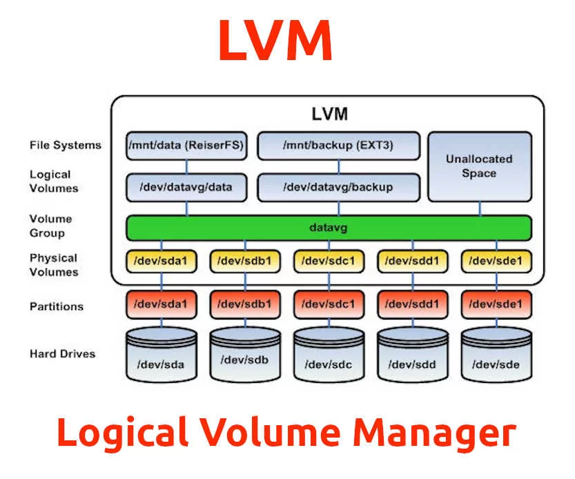
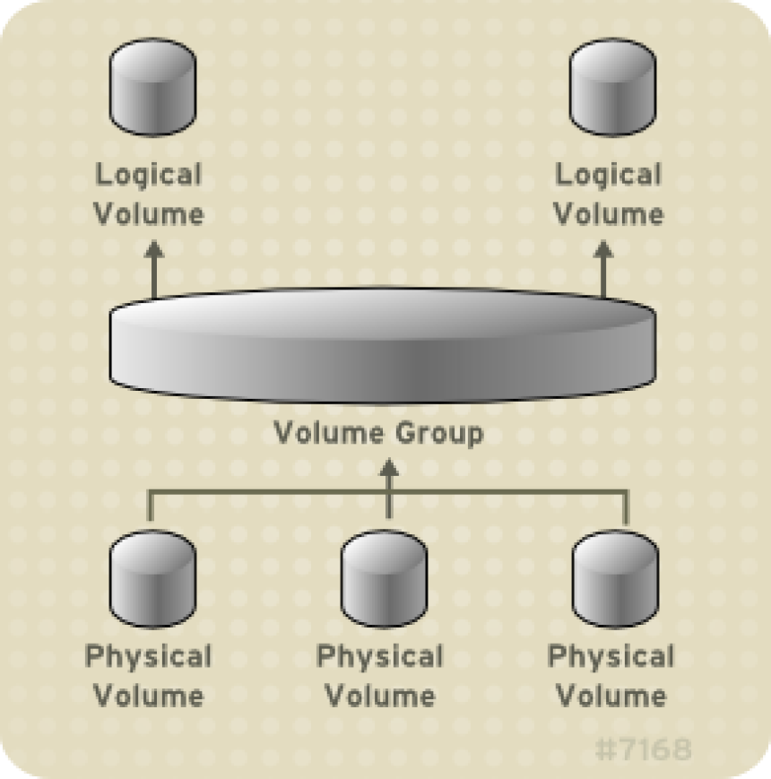

# Práctica 2d. Volúmenes Lógicos(LVM)

## Contexto
El volúmen de información a manejar crece e muchas ocasiones de forma no prevista. Una previsón a la baja en la asignación del espacio de almacenamiento en unidades físicas puede ocasionar quedarnos sin espacio con el problema que ello conlleva, una asignación a la alta supone perdida de espacio para otros fines. Mediante LVM o Logical Volumen Management obtenemos mediante una capa de abstracción sobre el volumen físico mayor flexibilidad a la hora de incrementar, reducir el espacio inicialmente previsto para nuestros datos.

En esta práctica se trabajará sobre la creación y gestión de volúmenes lógicos.

## Objetivos
* Entender que es LVM y como mejora el esquema estático de asignación de espacio.
* Explicar de forma gráfica la arquitectura de LVM.
* Crear y configrar LVM mediante comandos.
* Ser capaces de plantear un hipotético caso de ampliación de espacio en un volúmen lógico
* Documentar de forma correcta y completa los pasos llevados para realizar la práctica.


## Definición y Arquitectura de LVM
>[!NOTE]
> Explicar ayudándote de una imagen la arquitectura de LVM



A partir de unos discos duros, formamos los volúmenes físicos, que son, para LVM, de donde se calculará el espacio disponible y nos permitirán su sencillo manejo de espacio. Además, con estos volúmenes físicos, formamos un grupo de volúmenes, que nos servirá para unir muchos volúmenes físicos. A partir de un grupo, formamos los volúmenes lógicos, que alojarán los archivos con los que trabajaremos.

## Desarrollo
## Introducción
>[!NOTE]
> Explicar brevemente en que va a consistir la práctica, ayúdate de una imágen para tu explicación.

A partir de unos discos duros, previamente añadidos, vamos a crear un gestor de volúmenes lógicos, con el que podemos gestionar su almacenamiento y por tanto su contenido de manera sencilla, combinando diferentes espacios y asignando concretamente lo que necesitemos.

Para ello, a partir de los discos duros, crearemos los volúmenes físicos, que nos permitirán concentrarlos en un grupo. A partir de este grupo o grupos, creamos cada volúmen lógico, con el que trabajaremos de manera sencilla.
### Paso 1. Pasos previos
>[!NOTE]
> Explicar la ampliacion de la máquina virtual con nuevos discos duros
Para crear el entorno de trabajo para esta práctica, vamos a añadir estos discos duros mediante la siguiente configuración:
```bash 
  Vagrant.configure("2") do |config|
  config.vm.box = "generic/ubuntu2304"
  config.vm.box_version ='4.3.12'
  config.vm.hostname = 'generic-sad'
  config.vm.define vm_name = 'generic-sad'
  config.ssh.forward_agent = true
  config.ssh.forward_x11 = true
  config.vm.disk :disk, size: "200MB", name: "extra_storage1"
  config.vm.disk :disk, size: "200MB", name: "extra_storage2"
  config.vm.disk :disk, size: "200MB", name: "extra_storage3"
  config.vm.disk :disk, size: "200MB", name: "extra_storage4"
  config.vm.disk :disk, size: "200MB", name: "extra_storage5"
  config.vm.disk :disk, size: "200MB", name: "extra_storage6"
  ```
Una vez insertado, podemos comprobar si se han añadido todas con el comando `lsblk`

## Paso 2. Creación de los volúmenes físicos
A partir de los discos duros que tenemos, las hacemos volúmen físico con:
```bash
pvcreate /dev/sdb
pvcreate /dev/sdc
```
(Conviene hacerlo con todos los discos duros que vayamos a usar)

## Paso 3. Creación de grupos de volúmenes
Con este comando, estaremos asignando los volúmenes físicos en un grupo.
```bash
vgcreate vg-sad000 /dev/sdb /dev/sdc
```
### Paso 4. Creación de los volúmenes lógico
Para crear los volúmenes lógicos:
```bash
lvcreate -n lv_db -L 100MB vg-sad000
```
con el -n indicamos el nombre, y el -L es para indicar el espacio que queremos.

En caso de querer reasignar el espacio disponible:
```bash
lvextend -L 200MB /dev/vg-sad000/lv_db /dev/sdc /dev/sdd
```

### Paso 5. Asignación sistema de archivos
Con el siguiente comando, crearemos el sistema de archivos que utilizaremos en nuestras carpetas.
```bash
mkfs.ext4 /dev/vg-sad000/lv_projects
mkfs.ext4 /dev/vg-sad000/lv_web 
mkfs.ext4 /dev/vg-sad000/lv_net 
mkfs.ext4 /dev/vg-sad000/lv_db
```
Para terminar, montamos la partición para que sea accesible.
```bash
mkdir -p /mnt/projects
mount /dev/vg-sad000/lv_projects /mnt/projects/

```
El -p del mkdir nos asegura crear todos los directorios de la ruta especificada aunque no existan